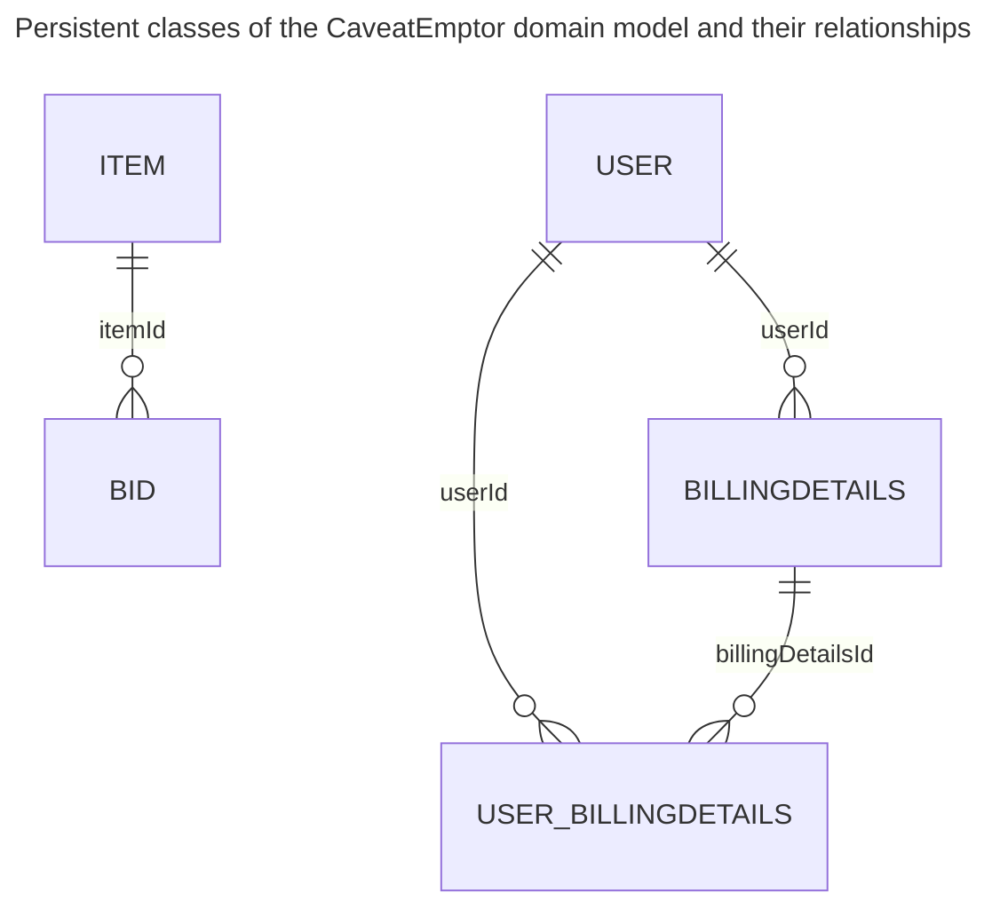

 
# Entity Relationship Diagrams

```mermaid
---
title:  Persistent classes of the CaveatEmptor domain model and their relationships
---

erDiagram


    ITEM ||--o{ BID : "itemId"
    USER ||--o{ BILLINGDETAILS : "userId"
    USER ||--o{ USER_BILLINGDETAILS : "userId"
    BILLINGDETAILS ||--o{ USER_BILLINGDETAILS : "billingDetailsId"
```
 