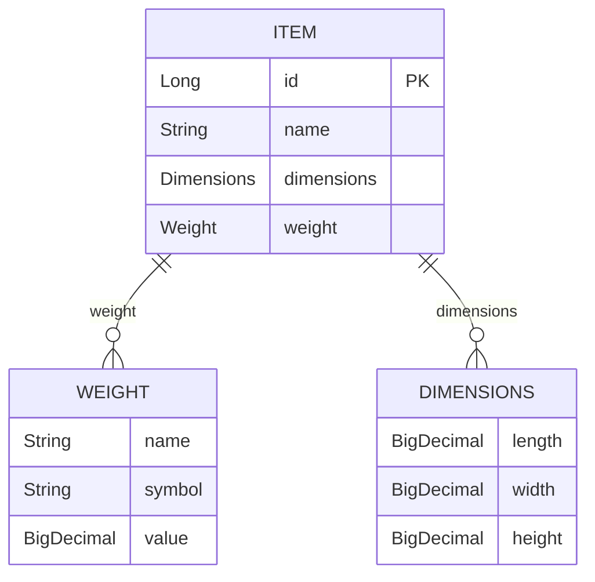

# Entity Relationship Diagrams

```mermaid 
erDiagram
    ITEM {
        Long id PK
        String name
        Dimensions dimensions
        Weight weight
    }
    WEIGHT {
        String name
        String symbol
        BigDecimal value
    }
    DIMENSIONS {
        BigDecimal length
        BigDecimal width
        BigDecimal height
    }

    ITEM ||--o{ WEIGHT : "weight"
    ITEM ||--o{ DIMENSIONS : "dimensions"
```
 