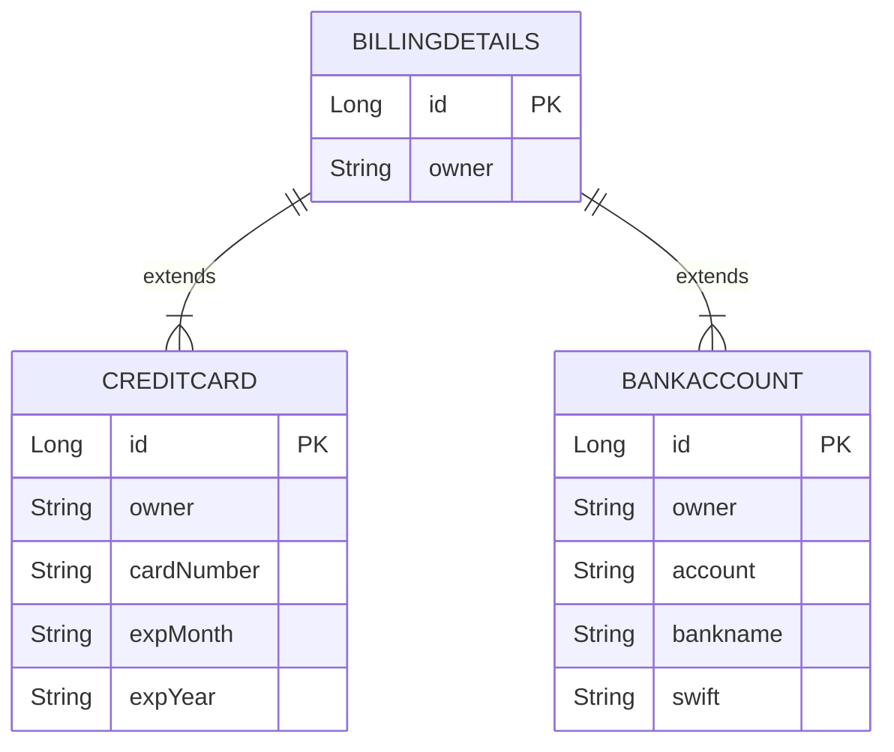

# Entity Relationship Diagrams

```mermaid 
erDiagram
    BILLINGDETAILS {
        Long id PK
        String owner
    }
    CREDITCARD {
        Long id PK
        String owner
        String cardNumber
        String expMonth
        String expYear
    }
    BANKACCOUNT {
        Long id PK
        String owner
        String account
        String bankname
        String swift
    }

    BILLINGDETAILS ||--|{ CREDITCARD : "extends"
    BILLINGDETAILS ||--|{ BANKACCOUNT : "extends"
```
 